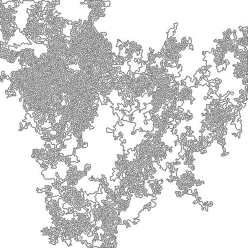
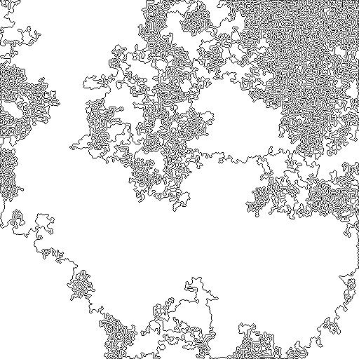

# Squiggles

A program to create generative squiggle images.

|  |  |
| --- | --- |
|  |  | 

Outlines are drawn in a semi-generative fashion, and are painted with a recursive flood fill algorithm.

| Outline | Flood filled|
| --- | --- |
|  |  |

To run:

`$ git clone https://github.com/rileythomp/Squiggles.git`

`$ cd Squiggles/src`

`$ javac *.java`

`$ java Main`

Then follow instructions and enter the type of image to generate.
